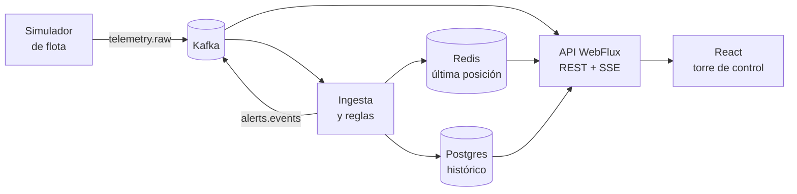

# Plan: Torre de control de flota (portafolio)

Sep 21, 2026 · @Miguel

## Objetivo y alcance

El MVP es una torre de control que muestra en vivo la posición de 50 a 200 vehículos simulados, el estado de sus entregas y las alertas operativas, con acceso por rol. Estimado total: 6 a 8 semanas a 8–10 h por semana.

**Regla de trabajo:** una fase = una rama + un PR + un tag. No se pasa a la siguiente fase sin cumplir su criterio "Hecho cuando".

**Qué demuestra en el portafolio**

- Arquitectura orientada a eventos (Kafka) con procesamiento reactivo (WebFlux).
- Tiempo real de extremo a extremo (SSE hasta el mapa en React).
- Seguridad por rol, idempotencia, manejo de fallos y pruebas de carga.
- Dominio logístico con KPIs de negocio (entregas a tiempo, tiempo detenido), donde tu perfil de ingeniería industrial suma.

| Dentro del MVP | Fuera del MVP |
| --- | --- |
| Flota, conductores y entregas | Optimización de rutas (VRP) |
| Telemetría GPS simulada | GPS real y app móvil del conductor |
| Alertas: velocidad, geocerca, parada, sin señal, retraso | Multi-tenant y facturación |
| KPIs operativos y dashboard | Predicción de ETA (queda como extensión) |
| Roles: ADMIN, DESPACHADOR, SUPERVISOR | Notificaciones por correo o SMS |

## Arquitectura

Un backend modular (un solo servicio Spring Boot) más un simulador aparte: los eventos entran por Kafka, se reparten a Redis y Postgres, y la API los empuja al navegador por SSE.

La ingesta y la API viven en el mismo servicio, separadas por paquetes. Dividirlas en dos servicios queda como mejora opcional una vez que el MVP funcione.

| Pieza | Responsabilidad en el proyecto |
| --- | --- |
| Kafka | Telemetría y alertas como eventos. Clave = `vehicleId` para conservar el orden por vehículo |
| Redis | Última posición por vehículo, estado de reglas con ventana, cache de KPIs, rate limiting |
| Postgres | Fuente de verdad: vehículos, conductores, entregas, alertas y telemetría histórica |
| WebFlux + R2DBC | API no bloqueante y streaming SSE. Liquibase aplica las migraciones (usa JDBC solo al arrancar) |
| Spring Security | JWT, roles y autorización por endpoint |
| React + TypeScript | Mapa, panel de flota, alertas y KPIs |

## Fase 0: Fundamentos (1 día)

El objetivo es tener un repo que se levante con un solo comando y CI verde desde el primer commit.

- [x] Dos repos públicos: `atlas-waypoint-backend` (servicio, `/simulator`, `/docs` y compose) y `atlas-waypoint-frontend`
- [ ] `docker-compose.yml` con Postgres, Redis, Kafka (modo KRaft) y Kafka UI
- [ ] Backend Spring Boot (Java 21, WebFlux, Actuator) con `/actuator/health`
- [ ] Frontend con Vite + React + TypeScript
- [ ] GitHub Actions: build y tests de backend y frontend
- [ ] README inicial con "cómo levantar el entorno" y commits convencionales

**Hecho cuando:** `docker compose up` y el arranque del backend responden `UP` en health, y el pipeline de CI pasa.

## Fase 1: Dominio y API (1 semana)

El objetivo es un CRUD reactivo y probado sobre el modelo mínimo, antes de tocar Kafka.

| Entidad | Campos clave |
| --- | --- |
| `vehicle` | id, placa, tipo, capacidad, estado |
| `driver` | id, nombre, vehículo asignado |
| `delivery` | id, vehículo, origen, destino, ventana planificada, estado (PENDING, IN\_TRANSIT, DELIVERED, DELAYED) |
| `position` | vehículo, timestamp, lat, lon, velocidad, rumbo |
| `alert` | id, vehículo, tipo, severidad, timestamp, reconocida por |

- [ ] Migraciones Liquibase (changelog YAML, changeSet inicial) con índice en `position (vehicle_id, ts)`
- [ ] Repositorios R2DBC y servicios, con DTOs separados de las entidades
- [ ] CRUD de vehículos, conductores y entregas con Bean Validation
- [ ] Manejo global de errores con `ProblemDetail` (RFC 7807)
- [ ] OpenAPI con springdoc-webflux
- [ ] Pruebas: repositorios con Testcontainers, servicios con `StepVerifier`

**Hecho cuando:** los endpoints CRUD pasan sus pruebas contra un Postgres real en Testcontainers.

## Fase 2: Seguridad (3 a 4 días)

El objetivo es que ningún endpoint quede abierto por accidente y que los permisos estén definidos en una matriz explícita.

| Acción | ADMIN | DESPACHADOR | SUPERVISOR |
| --- | --- | --- | --- |
| Ver mapa, flota y alertas | sí | sí | sí |
| Crear y asignar entregas | sí | sí | no |
| Reconocer alertas | sí | sí | no |
| Gestionar vehículos y conductores | sí | no | no |
| Gestionar usuarios | sí | no | no |

- [ ] Tablas `app_user` y roles, con contraseñas en BCrypt
- [ ] `SecurityWebFilterChain`: login que emite JWT de acceso corto (15 min)
- [ ] Refresh token en cookie `httpOnly` con rotación
- [ ] Autorización por ruta y por método según la matriz
- [ ] CORS limitado al origen del frontend
- [ ] Pruebas de autorización: 401, 403 y 200 por rol en cada endpoint

**Hecho cuando:** cada endpoint tiene su prueba de 401/403/200 y no existe ruta sin regla explícita.

## Fase 3: Kafka e ingesta (1 semana)

El objetivo es un pipeline que procese telemetría de 100 vehículos sin perder ni duplicar mensajes, incluso con datos sucios.

| Topic | Uso | Notas |
| --- | --- | --- |
| `telemetry.raw` | Posiciones que publica el simulador | 6 particiones, clave = `vehicleId` |
| `telemetry.dlt` | Mensajes que fallaron tras los reintentos | Se revisa a mano en Kafka UI |
| `alerts.events` | Alertas generadas por las reglas | Se usa en la Fase 6 |

- [ ] Simulador (app aparte): cada vehículo recorre una ruta predefinida y publica cada 2 a 5 s
- [ ] Ruido controlado en el simulador: excesos de velocidad, paradas, mensajes duplicados y desordenados
- [ ] Evento JSON con `schemaVersion` para poder evolucionarlo
- [ ] Consumidor reactivo (reactor-kafka) con reintentos y envío a `telemetry.dlt`
- [ ] Idempotencia: descartar duplicados por `(vehicleId, ts)`
- [ ] Persistencia en Postgres por lotes

**Hecho cuando:** con 100 vehículos durante 10 minutos, los mensajes publicados coinciden con los persistidos (descontando duplicados) y no hay lag creciente.

## Fase 4: Tiempo real y Redis (4 a 5 días)

El objetivo es que un cambio de posición llegue del consumidor al cliente en menos de 1 segundo, sin saturar a los clientes lentos.

- [ ] Redis: hash `vehicle:{id}:last` con la última posición y TTL de 5 min (su expiración sirve para detectar "sin señal")
- [ ] `GET /fleet/snapshot` con todas las últimas posiciones leídas desde Redis
- [ ] `GET /fleet/stream` (SSE): `Flux` alimentado por un sink multicast desde el consumidor
- [ ] Backpressure: `onBackpressureLatest` o `sample(1s)` por vehículo
- [ ] Reconexión con `Last-Event-ID` para no perder eventos tras un corte
- [ ] Cache de KPIs en Redis con TTL de 30 s
- [ ] Autorización del stream: el mismo JWT y las mismas reglas de la Fase 2

**Hecho cuando:** con 100 vehículos el snapshot responde en menos de 50 ms y el stream entrega cada actualización a un cliente en menos de 1 s (medido con un cliente de prueba).

## Fase 5: Frontend React (1 a 1,5 semanas)

El objetivo es que un despachador vea la flota moverse en el mapa y actúe sobre una alerta desde la misma pantalla.

- [ ] Login y rutas protegidas por rol; access token en memoria, refresh por cookie
- [ ] Mapa (Leaflet o MapLibre) con marcadores que se mueven y color por estado
- [ ] Conexión SSE con `@microsoft/fetch-event-source` (permite el header `Authorization`) y reconexión automática
- [ ] Panel lateral con lista de vehículos, búsqueda y filtro por estado
- [ ] Detalle de vehículo: recorrido (polilínea desde el histórico), velocidad y entrega actual
- [ ] Panel de alertas con acción "reconocer"
- [ ] TanStack Query para REST y un store liviano (Zustand) para el estado del stream
- [ ] Pruebas de componentes clave con Vitest y Testing Library

**Hecho cuando:** un usuario DESPACHADOR inicia sesión, ve moverse la flota y reconoce una alerta; un SUPERVISOR ve lo mismo sin poder reconocerla.

## Fase 6: Alertas y KPIs (1 semana)

El objetivo es convertir la telemetría en información accionable, que es lo que diferencia este proyecto de un simple mapa.

| Regla | Cómo se detecta | Tipo de alerta |
| --- | --- | --- |
| Exceso de velocidad | Velocidad sobre el límite en N lecturas consecutivas | `SPEEDING` |
| Salida de zona | Punto fuera del polígono asignado (PostGIS o ray casting) | `GEOFENCE_EXIT` |
| Parada prolongada | Velocidad cercana a 0 por más de X min fuera de un punto de entrega | `LONG_STOP` |
| Sin señal | Expira el TTL de la última posición en Redis | `NO_SIGNAL` |
| Entrega retrasada | ETA posterior a la ventana planificada | `DELIVERY_DELAYED` |

- [ ] Interfaz `AlertRule` con una clase por regla, sin framework de reglas
- [ ] Estado por vehículo en Redis para las reglas con ventana de tiempo
- [ ] Publicar en `alerts.events`, persistir en Postgres y empujar por SSE
- [ ] Deduplicar: no repetir una alerta mientras siga activa
- [ ] KPIs: porcentaje de entregas a tiempo, km recorridos, tiempo detenido y utilización de flota
- [ ] Endpoint de KPIs con cache y tarjetas en el dashboard

**Hecho cuando:** el simulador provoca cada tipo de alerta y aparece una sola vez en la UI; los KPIs coinciden con un cálculo manual sobre los datos del simulador.

## Fase 7: Calidad y despliegue (1 semana)

El objetivo es tener evidencia medible de que el sistema aguanta carga y se puede operar.

- [ ] Pruebas de integración de extremo a extremo con Testcontainers (Kafka, Redis y Postgres)
- [ ] Prueba de carga con k6 o Gatling: 500 vehículos y p95 de latencia del stream
- [ ] Observabilidad: Micrometer, Prometheus y Grafana (lag del consumidor, latencia, alertas por minuto)
- [ ] Logs estructurados con `correlationId`
- [ ] Dockerfiles multi-stage y compose de "producción"
- [ ] Despliegue de demo con HTTPS (VPS, Fly.io o Railway)
- [ ] Secretos por variables de entorno y Dependabot activo

**Hecho cuando:** hay una demo pública con usuarios de prueba y un dashboard de métricas con resultados de carga documentados.

## Fase 8: Portafolio y extensiones (2 a 3 días)

El objetivo es que un reclutador entienda el problema, las decisiones y los resultados en 3 minutos, sin clonar el repo.

- [ ] README con problema, diagrama de arquitectura, cómo correrlo con un comando y enlace a la demo
- [ ] ADRs cortos (una página cada uno): por qué WebFlux, por qué Kafka, por qué Redis
- [ ] Video o GIF de 60 a 90 s con el flujo completo
- [ ] Resultados de carga con números reales
- [ ] Sección "Trade-offs y qué haría distinto"
- [ ] Publicación en LinkedIn y CV, con enfoque de negocio: visibilidad de la flota y reducción de tiempos muertos

**Extensiones opcionales, en este orden de valor**

1. Predicción de ETA con un servicio en Python consumiendo Kafka.
2. Reproducción histórica de recorridos (replay).
3. Optimización de rutas.
4. Multi-tenant.
